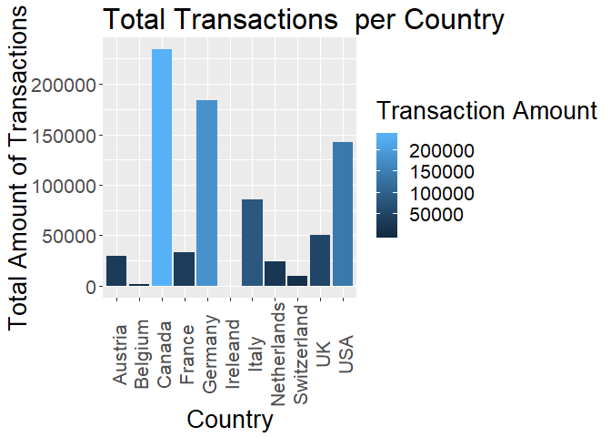
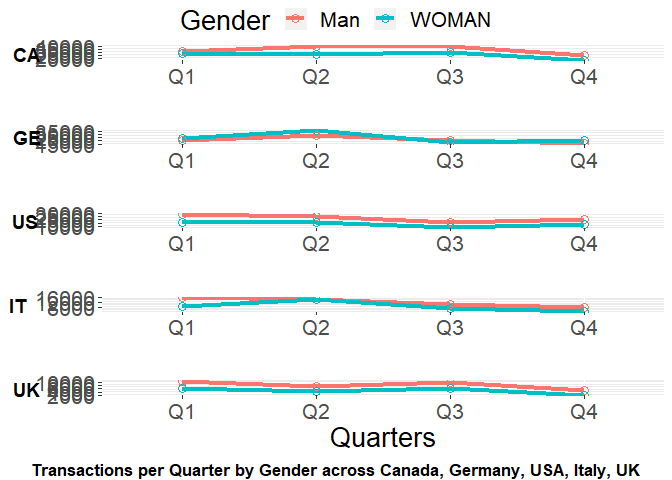
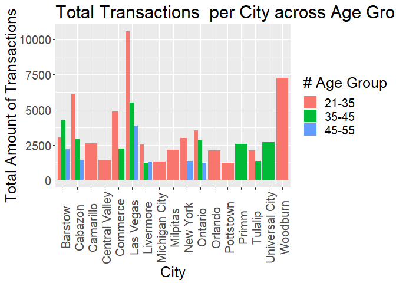
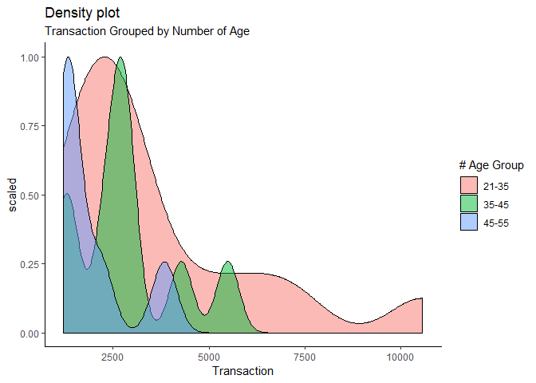

Fossil Data Quality and Analysis
================
Niket Choudhary

``` r
q1 <- read.csv(file.choose(), header = T, na.strings = c("NA",""," ",".")) # Load the data from file, after saving xlsx file as csv in Excel.
```

``` r
summary(q1)
```

    ##   Brand.Name                          Store.Name  
    ##  Fossil:6034   Vancouver Designer Outlet   : 662  
    ##                Toronto Premium             : 267  
    ##                3947 Fossil Metzingen       : 240  
    ##                Fossil Bicester             : 216  
    ##                3985 Fossil Frankfurt Zeil  : 207  
    ##                Outlet Collection at Niagara: 207  
    ##                (Other)                     :4235  
    ##                   City          State            Zip       Outlet  
    ##  Richmond           : 732   BC     : 914   V7B 0B7 : 662   N:1939  
    ##  Halton Hills       : 267   ON     : 902   L7G 0J1 : 267   Y:4095  
    ##  Metzingen          : 240   CA     : 541   72555   : 240           
    ##  Frankfurt am Main  : 221   AB     : 183   OX26 6WD: 216           
    ##  Bicester           : 216   NV     : 155   60313   : 207           
    ##  Niagara on the Lake: 207   (Other): 654   (Other) :4440           
    ##  (Other)            :4151   NA's   :2685   NA's    :   2           
    ##     Country     Transaction.Amount.in.USD Payment.Network
    ##  Canada :2188   Min.   :   0.0105         AE  : 490      
    ##  Germany:1201   1st Qu.:  57.7730         JCB : 206      
    ##  USA    :1166   Median : 102.3677         MC  : 331      
    ##  Italy  : 463   Mean   : 135.0749         UP  :3249      
    ##  UK     : 382   3rd Qu.: 173.2260         VISA:1758      
    ##  Austria: 200   Max.   :2870.5119                        
    ##  (Other): 434                                            
    ##   Customer.ID           YYYYMMDD             Age          Gender    
    ##  Min.   :4.033e+13   Min.   :20160101   Min.   :21.00   Man  :3470  
    ##  1st Qu.:4.195e+13   1st Qu.:20160611   1st Qu.:32.00   WOMAN:2564  
    ##  Median :4.601e+13   Median :20160908   Median :38.00               
    ##  Mean   :4.702e+13   Mean   :20163275   Mean   :39.07               
    ##  3rd Qu.:5.091e+13   3rd Qu.:20170115   3rd Qu.:46.00               
    ##  Max.   :8.066e+13   Max.   :20170630   Max.   :76.00               
    ##                                                                     
    ##  CN.ZIP..First.4. Transaction.Code     Date.and.Time.In.China
    ##  1000   : 921     Min.   :   176   2/1/2017 10:34 :   4      
    ##  2000   : 477     1st Qu.:222428   10/4/2016 10:46:   3      
    ##  5180   : 360     Median :445135   12/9/2016 11:02:   3      
    ##  5100   : 184     Mean   :449498   4/11/2017 10:35:   3      
    ##  7100   : 173     3rd Qu.:681154   4/15/2016 21:35:   3      
    ##  2100   : 171     Max.   :899780   7/30/2016 22:29:   3      
    ##  (Other):3748                      (Other)        :6015      
    ##  Transaction.Amount.in.USD..Pre.Tax. Local.Time    
    ##  Mode:logical                        Mode:logical  
    ##  NA's:6034                           NA's:6034     
    ##                                                    
    ##                                                    
    ##                                                    
    ##                                                    
    ## 

See if our Data has Missing values

``` r
sapply(q1, function(x){sum(is.na(x))})
```

    ##                          Brand.Name                          Store.Name 
    ##                                   0                                   0 
    ##                                City                               State 
    ##                                   0                                2685 
    ##                                 Zip                              Outlet 
    ##                                   2                                   0 
    ##                             Country           Transaction.Amount.in.USD 
    ##                                   0                                   0 
    ##                     Payment.Network                         Customer.ID 
    ##                                   0                                   0 
    ##                            YYYYMMDD                                 Age 
    ##                                   0                                   0 
    ##                              Gender                    CN.ZIP..First.4. 
    ##                                   0                                   0 
    ##                    Transaction.Code              Date.and.Time.In.China 
    ##                                   0                                   0 
    ## Transaction.Amount.in.USD..Pre.Tax.                          Local.Time 
    ##                                6034                                6034

We have two empty columns, Transaction.Amount.in.USD..Pre.Tax. and Local.Time. We have 2 missing values in Zip, 2685 missing in State.

Transaction.Code should have unique values, let's check

``` r
length(unique(q1$Transaction.Code))
```

    ## [1] 5914

``` r
length(unique(q1$Store.Name))
```

    ## [1] 255

Well it seems we have repetitions here, we should only consider rows with unique Transaction.Code

``` r
q1 <- q1[!duplicated(q1$Transaction.Code),]
```

Let's check again

``` r
length(unique(q1$Transaction.Code))
```

    ## [1] 5914

In our analysis we can drop certain columns

``` r
q1$Transaction.Amount.in.USD..Pre.Tax. <- NULL
q1$State <- NULL
q1$Zip <- NULL
q1$CN.ZIP..First.4. <- NULL
q1$Local.Time <- NULL
q1$YYYYMMDD <- NULL
```

Let us extract name of the month

``` r
q1$Date <- as.Date(q1$Date.and.Time.In.China, format="%m/%d/%Y")

q1$Month_name <- as.factor(format(q1$Date, "%B" ))
q1$Month <- as.factor(format(q1$Date, "%m" ))
```

Let's look at the Age distribution

``` r
summary(q1$Age)
```

    ##    Min. 1st Qu.  Median    Mean 3rd Qu.    Max. 
    ##   21.00   32.00   38.00   39.09   46.00   76.00

Let's classify Age in groups

``` r
q1$Age_group <- '65+'
q1$Age_group[q1$Age < 65 & q1$Age >= 55] <- '55-65'
q1$Age_group[q1$Age < 55 & q1$Age >= 45] <- '45-55'
q1$Age_group[q1$Age < 45 & q1$Age >= 35] <- '35-45'
q1$Age_group[q1$Age < 35] <- '21-35'
```

Let's look at the Month distribution

``` r
table(q1$Month_name)
```

    ## 
    ##     April    August  December  February   January      July      June 
    ##       522       538       282       570       484       533       686 
    ##     March       May  November   October September 
    ##       498       591       342       447       421

Let's classify Month in Quarters

``` r
q1$Quarters <- quarters(q1$Date)
```

Let's look which gender is purchasing more

``` r
agg_gender <- aggregate(Customer.ID ~ Gender , data = q1, length)
agg_gender
```

    ##   Gender Customer.ID
    ## 1    Man        3402
    ## 2  WOMAN        2512

We have more Male customers.

Total spending per country

``` r
agg_amount <- aggregate(Transaction.Amount.in.USD ~ Country , data = q1, sum)
agg_amount <- agg_amount[with(agg_amount,order(-Transaction.Amount.in.USD)),]
agg_amount
```

    ##        Country Transaction.Amount.in.USD
    ## 3       Canada               234167.0912
    ## 5      Germany               183904.4520
    ## 11         USA               142546.4091
    ## 7        Italy                85148.6018
    ## 10          UK                50596.8849
    ## 4       France                33601.7983
    ## 1      Austria                29983.3459
    ## 8  Netherlands                24333.2621
    ## 9  Switzerland                 9736.1106
    ## 2      Belgium                 2019.3036
    ## 6     Ireleand                  173.4228

``` r
library(ggplot2)

ggplot(agg_amount, aes(x = Country, y = Transaction.Amount.in.USD)) + 
  geom_bar(aes(fill = Transaction.Amount.in.USD), stat = "identity") +
  xlab("Country") + ylab("Total Amount of Transactions") + labs(title = "Total Transactions  per Country", fill="Transaction Amount") +
  theme(text = element_text(size = 20), axis.text.x = element_text(angle = 90, vjust = 0.6))
```



``` r
 # geom_text(aes(label = Country), vjust = -1) 
```

The 5 biggest market for Fossil are Canada, Germany, USA, Italy, UK

Let's look in detail at top 5 countries

``` r
agg_country <- aggregate(Transaction.Amount.in.USD ~ Country + Quarters + Gender, data = q1, sum)
agg_country <- agg_country[with(agg_country,order(-Transaction.Amount.in.USD)),]
agg_country
```

    ##        Country Quarters Gender Transaction.Amount.in.USD
    ## 24      Canada       Q3    Man                39377.1039
    ## 13      Canada       Q2    Man                38984.8973
    ## 54     Germany       Q2  WOMAN                36820.0529
    ## 3       Canada       Q1    Man                30649.0124
    ## 10         USA       Q1    Man                28998.3762
    ## 62      Canada       Q3  WOMAN                28857.6274
    ## 42      Canada       Q1  WOMAN                28736.1608
    ## 15     Germany       Q2    Man                27920.9188
    ## 52      Canada       Q2  WOMAN                26343.9434
    ## 21         USA       Q2    Man                24734.2113
    ## 33      Canada       Q4    Man                24258.3331
    ## 44     Germany       Q1  WOMAN                24026.1335
    ## 5      Germany       Q1    Man                20759.7590
    ## 26     Germany       Q3    Man                20533.7188
    ## 73     Germany       Q4  WOMAN                20195.4219
    ## 40         USA       Q4    Man                20003.0113
    ## 64     Germany       Q3  WOMAN                18294.0356
    ## 71      Canada       Q4  WOMAN                16960.0128
    ## 31         USA       Q3    Man                16470.6498
    ## 59         USA       Q2  WOMAN                16123.3669
    ## 6        Italy       Q1    Man                16024.9211
    ## 49         USA       Q1  WOMAN                15487.6500
    ## 35     Germany       Q4    Man                15354.4115
    ## 17       Italy       Q2    Man                15037.6839
    ## 55       Italy       Q2  WOMAN                14298.0877
    ## 78         USA       Q4  WOMAN                12449.7876
    ## 27       Italy       Q3    Man                10411.8270
    ## 9           UK       Q1    Man                10283.9485
    ## 30          UK       Q3    Man                 9580.5756
    ## 45       Italy       Q1  WOMAN                 8867.6592
    ## 69         USA       Q3  WOMAN                 8279.3560
    ## 36       Italy       Q4    Man                 7878.9283
    ## 65       Italy       Q3  WOMAN                 7678.5071
    ## 4       France       Q1    Man                 7193.7993
    ## 20          UK       Q2    Man                 7126.0140
    ## 48          UK       Q1  WOMAN                 6308.7945
    ## 68          UK       Q3  WOMAN                 6216.5743
    ## 11     Austria       Q2    Man                 5456.8318
    ## 14      France       Q2    Man                 5290.5016
    ## 43      France       Q1  WOMAN                 5064.2060
    ## 53      France       Q2  WOMAN                 5002.9467
    ## 74       Italy       Q4  WOMAN                 4950.9875
    ## 25      France       Q3    Man                 4836.2514
    ## 39          UK       Q4    Man                 4713.9914
    ## 50     Austria       Q2  WOMAN                 4628.0508
    ## 22     Austria       Q3    Man                 4429.4854
    ## 46 Netherlands       Q1  WOMAN                 4410.3354
    ## 1      Austria       Q1    Man                 4328.8924
    ## 58          UK       Q2  WOMAN                 4147.5370
    ## 56 Netherlands       Q2  WOMAN                 3877.0389
    ## 60     Austria       Q3  WOMAN                 3863.0325
    ## 7  Netherlands       Q1    Man                 3450.3115
    ## 18 Netherlands       Q2    Man                 3109.0753
    ## 34      France       Q4    Man                 3022.8027
    ## 41     Austria       Q1  WOMAN                 2779.9657
    ## 28 Netherlands       Q3    Man                 2700.5332
    ## 63      France       Q3  WOMAN                 2686.4231
    ## 70     Austria       Q4  WOMAN                 2675.7136
    ## 37 Netherlands       Q4    Man                 2438.4079
    ## 29 Switzerland       Q3    Man                 2270.5540
    ## 77          UK       Q4  WOMAN                 2219.4498
    ## 66 Netherlands       Q3  WOMAN                 2189.0704
    ## 75 Netherlands       Q4  WOMAN                 2158.4896
    ## 57 Switzerland       Q2  WOMAN                 2028.0040
    ## 32     Austria       Q4    Man                 1821.3738
    ## 8  Switzerland       Q1    Man                 1762.4361
    ## 19 Switzerland       Q2    Man                 1194.8382
    ## 38 Switzerland       Q4    Man                 1040.7953
    ## 12     Belgium       Q2    Man                  893.0771
    ## 67 Switzerland       Q3  WOMAN                  699.1790
    ## 76 Switzerland       Q4  WOMAN                  612.9770
    ## 72      France       Q4  WOMAN                  504.8676
    ## 61     Belgium       Q3  WOMAN                  420.8159
    ## 51     Belgium       Q2  WOMAN                  324.3327
    ## 23     Belgium       Q3    Man                  237.3237
    ## 16    Ireleand       Q2    Man                  173.4228
    ## 2      Belgium       Q1    Man                  143.7541
    ## 47 Switzerland       Q1  WOMAN                  127.3270

``` r
Canada <- agg_country[agg_country$Country == "Canada",]
Germany <- agg_country[agg_country$Country == "Germany",]
USA <- agg_country[agg_country$Country == "USA",]
Italy <- agg_country[agg_country$Country == "Italy",]
UK <- agg_country[agg_country$Country == "UK",]
```

``` r
ggcanada <- ggplot(Canada, aes(x = Quarters, y = Transaction.Amount.in.USD, colour = Gender, group = Gender)) + 
  geom_line(size = 1.5) + 
  geom_point(size = 2.8, shape = 21) +
  labs(y = " ", x = " ") + theme(text = element_text(size=20))
  #scale_colour_manual(values=c("blue", "red"))  

gggermany <- ggplot(Germany, aes(x = Quarters, y = Transaction.Amount.in.USD, colour = Gender, group = Gender)) + 
  geom_line(size = 1.5) + 
  geom_point(size = 2.8, shape = 21) +
  labs(y = " ", x = " ") + theme(text = element_text(size=20))
   # scale_colour_manual(values=c("blue", "red")) 

ggusa <- ggplot(USA, aes(x = Quarters, y = Transaction.Amount.in.USD, colour = Gender, group = Gender)) + 
  geom_line(size = 1.5) + 
  geom_point(size = 2.8, shape = 21) +
  labs(y = " ", x = " ") + theme(text = element_text(size=20))
   # scale_colour_manual(values=c("blue", "red")) 

gggitaly <- ggplot(Italy, aes(x = Quarters, y = Transaction.Amount.in.USD, colour = Gender, group = Gender)) + 
  geom_line(size = 1.5) + 
  geom_point(size = 2.8, shape = 21) + 
  labs(y = " ", x = " ") + theme(text = element_text(size=20))
    #scale_colour_manual(values=c("blue", "red")) 

gguk <- ggplot(UK, aes(x = Quarters, y = Transaction.Amount.in.USD, colour = Gender, group = Gender)) + 
  geom_line(size = 1.5) + 
  geom_point(size = 2.8, shape = 21) +
  labs(y = " ", x = "Quarters") + theme(text = element_text(size=20))
    #scale_colour_manual(values=c("blue", "red"))
```

``` r
#library("gridExtra")
#library("cowplot")
library(ggpubr)
```

    ## Loading required package: magrittr

``` r
figure <- ggarrange(ggcanada, gggermany, ggusa, gggitaly, gguk, heights = c(8, 8, 8, 8, 8),
          ncol = 1, nrow = 5, labels = c("CA", "GE", "US", "IT", "UK"), common.legend = TRUE)


annotate_figure(figure, bottom = text_grob("Transactions per Quarter by Gender across Canada, Germany, USA, Italy, UK", color = "black", face = "bold", size = 12.9))
```



We can see a general trend of lower transactions in Q4 compared to Q1.

Now let's look at total spending per City in USA by age group

``` r
agg_amount_USA <- aggregate(Transaction.Amount.in.USD[q1$Country == 'USA'] ~ City[q1$Country == 'USA'] + Age_group[q1$Country == 'USA'], data = q1, sum)
agg_amount_USA <- agg_amount_USA[with(agg_amount_USA,order(-`Transaction.Amount.in.USD[q1$Country == "USA"]`)),]
agg_amount_USA <- agg_amount_USA[1:30,]
agg_amount_USA
```

    ##     City[q1$Country == "USA"] Age_group[q1$Country == "USA"]
    ## 37                  Las Vegas                          21-35
    ## 76                   Woodburn                          21-35
    ## 9                     Cabazon                          21-35
    ## 111                 Las Vegas                          35-45
    ## 16                   Commerce                          21-35
    ## 85                    Barstow                          35-45
    ## 170                 Las Vegas                          45-55
    ## 49                    Ontario                          21-35
    ## 6                     Barstow                          21-35
    ## 47                   New York                          21-35
    ## 90                    Cabazon                          35-45
    ## 124                   Ontario                          35-45
    ## 141            Universal City                          35-45
    ## 10                  Camarillo                          21-35
    ## 129                     Primm                          35-45
    ## 39                  Livermore                          21-35
    ## 96                   Commerce                          35-45
    ## 151                   Barstow                          45-55
    ## 43                   Milpitas                          21-35
    ## 72                    Tulalip                          21-35
    ## 50                    Orlando                          21-35
    ## 154                   Cabazon                          45-55
    ## 12             Central Valley                          21-35
    ## 140                   Tulalip                          35-45
    ## 177                  New York                          45-55
    ## 173                 Livermore                          45-55
    ## 42              Michigan City                          21-35
    ## 114                 Livermore                          35-45
    ## 56                  Pottstown                          21-35
    ## 178                   Ontario                          45-55
    ##     Transaction.Amount.in.USD[q1$Country == "USA"]
    ## 37                                       10555.503
    ## 76                                        7241.438
    ## 9                                         6096.828
    ## 111                                       5489.342
    ## 16                                        4876.290
    ## 85                                        4276.299
    ## 170                                       3839.456
    ## 49                                        3536.934
    ## 6                                         3039.409
    ## 47                                        2998.446
    ## 90                                        2912.342
    ## 124                                       2819.639
    ## 141                                       2673.521
    ## 10                                        2613.724
    ## 129                                       2562.340
    ## 39                                        2516.051
    ## 96                                        2227.743
    ## 151                                       2177.677
    ## 43                                        2164.186
    ## 72                                        2090.504
    ## 50                                        2087.972
    ## 154                                       1455.226
    ## 12                                        1425.169
    ## 140                                       1360.890
    ## 177                                       1344.373
    ## 173                                       1300.500
    ## 42                                        1297.873
    ## 114                                       1230.740
    ## 56                                        1216.074
    ## 178                                       1210.645

Let's plot a graph with the top 30 transactions across major cities

``` r
ggplot(agg_amount_USA, aes(x = `City[q1$Country == "USA"]`, y = `Transaction.Amount.in.USD[q1$Country == "USA"]`, fill = `Age_group[q1$Country == "USA"]`)) +
    geom_bar(stat = "identity", position = position_dodge()) +
    xlab("City") + ylab("Total Amount of Transactions") + labs(title = "Total Transactions  per City across Age Groups in USA",  fill="# Age Group") +
    theme(text = element_text(size = 19), axis.text.x = element_text(angle = 90, vjust = 0.6))
```

 We observe that Age group 21-35 does most shopping followed by others

``` r
library(ggplot2)
theme_set(theme_classic())

# Plot
g <- ggplot(agg_amount_USA, aes(`Transaction.Amount.in.USD[q1$Country == "USA"]`))

g + geom_density(aes(fill = factor(`Age_group[q1$Country == "USA"]`), y=..scaled..), alpha = 0.5) + 
    coord_cartesian(xlim=c(1200, 10600)) +
    labs(title = "Density plot", 
         subtitle = "Transaction Grouped by Number of Age",
         x = "Transaction",
         fill="# Age Group") 
```

 Here we can clearly observe that Age group 21-35 has a high Transaction amount.
